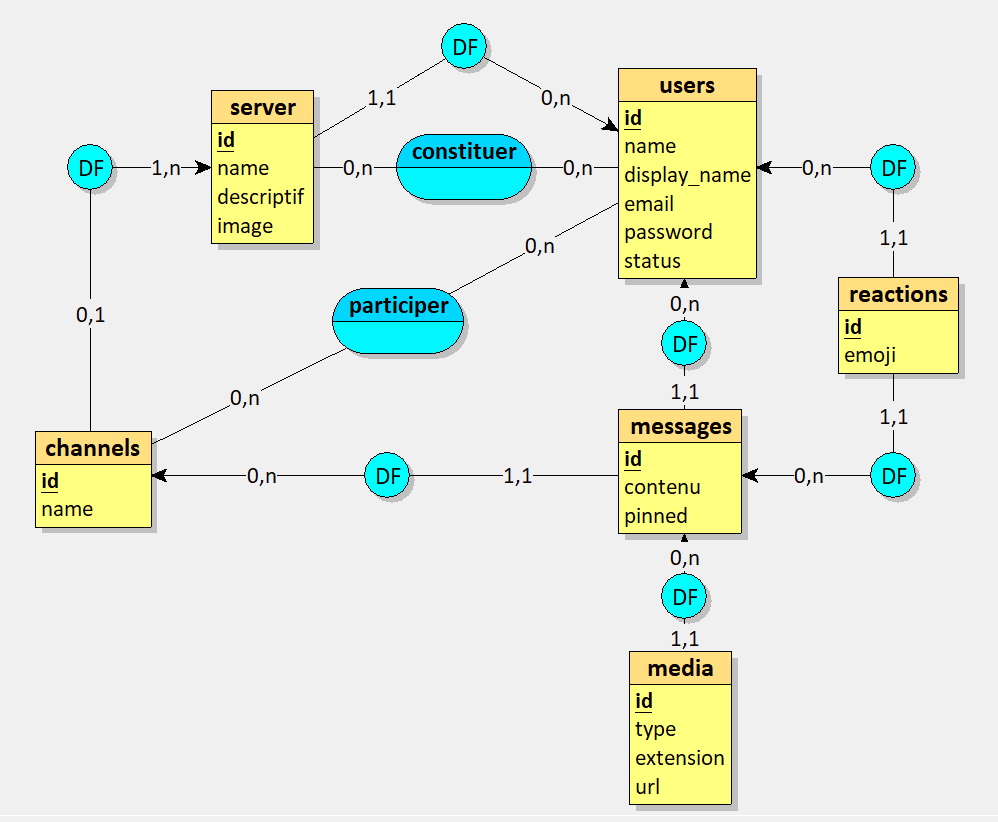

# Lesha - Chat Application

Lesha is a real-time chat application with features similar to Discord, allowing users to communicate through messages, reactions, and media sharing in organized servers and channels.

## Features

- **User Authentication**: Secure login/registration with JWT token-based authentication
- **Server Management**: Create, join, and manage servers
- **Channel Organization**: Organize conversations through channels within servers
- **Real-time Communication**: WebSocket-based messaging for instant communication
- **Media Sharing**: Upload and share images, videos, and audio files in messages
- **Reactions**: Add emoji reactions to messages
- **Friend System**: Add friends and manage relationships

## Technology Stack

### Backend

- **Language**: Go
- **Web Framework**: Gorilla Mux for HTTP routing
- **WebSockets**: Gorilla WebSocket for real-time communication
- **Database ORM**: GORM for database operations
- **Authentication**: JWT for secure authentication
- **Database**: MySQL for data persistence

### Frontend

- **Framework**: React with TypeScript
- **State Management**: React Hooks
- **HTTP Client**: Fetch API for REST requests
- **WebSocket Client**: Native WebSocket API for real-time updates
- **Styling**: Tailwind CSS for responsive design

## Database Structure

The application uses a relational database with the following entity relationship diagram:



### Key Entities

### User
- ID (Primary Key)
- Name
- DisplayName
- Email
- Password (hashed)
- Status

### Server
- ID (Primary Key)
- Name
- Description
- Image
- UserID (Foreign Key to User)

### Channel
- ID (Primary Key)
- Name
- ServerID (Foreign Key to Server)

### Message
- ID (Primary Key)
- Content
- UserID (Foreign Key to User)
- ChannelID (Foreign Key to Channel)
- Pinned (Boolean)
- CreatedAt (Timestamp)

### Media
- ID (Primary Key)
- MessageID (Foreign Key to Message)
- Type (image, video, audio)
- Extension
- Url

### Reaction
- ID (Primary Key)
- Emoji
- UserID (Foreign Key to User)
- MessageID (Foreign Key to Message)

### Friendship
- ID (Primary Key)
- UserID (Foreign Key to User)
- FriendID (Foreign Key to User)
- Status

### Entity Relationships

- A User can have many Servers, Messages, Reactions, and Friends
- A Server can have many Channels
- A Channel can have many Messages
- A Message can have many Reactions and Media files
- Messages, Reactions, and Media belong to specific Users

## Project Structure

```
lesha/
├── client/               # Frontend React application
│   ├── src/              
│   │   ├── components/   # React components
│   │   ├── hooks/        # Custom React hooks
│   │   └── ...
└── server/               # Backend Go application
    ├── cmd/              # Application entry points
    └── internal/         # Private application code
        ├── controllers/  # HTTP request handlers
        ├── entity/       # Data models
        ├── repositories/ # Database operations
        ├── services/     # Business logic
        └── ws/           # WebSocket handlers
```

## Key Features Implementation

### Real-time Messaging

Messages are sent and received in real-time using WebSockets. The backend handles different message types (text, media) and broadcasts them to all clients connected to the same channel.

### File Uploads

Files (images, videos, audio) can be uploaded with messages:
- Files are stored in the `uploads/` directory with unique filenames
- File metadata is saved in the database and linked to messages
- Clients can access media through static file serving

### Reactions

Users can add emoji reactions to messages:
- Reactions are stored in the database and linked to messages and users
- Real-time updates notify all users when reactions are added
- The UI groups identical reactions and shows counts

## Getting Started

### Prerequisites

- Go 1.23+
- Node.js 16+
- MySQL database

.env dans /server (racine)
exemple:

DB_URL="root:@tcp(127.0.0.1:3306)/lesha?charset=utf8mb4&parseTime=True&loc=Local"
JWT_SECRET="secret"


### Backend Setup

1. Clone the repository
2. Navigate to the server directory: `cd lesha/server`
3. Install dependencies: `go mod download`
4. Set up your `.env` file with database credentials
5. Run the server: `go run cmd/main.go`

### Frontend Setup

1. Navigate to the client directory: `cd lesha/client`
2. Install dependencies: `npm install`
3. Start the development server: `npm run dev`

## API Routes

The application provides RESTful APIs for:
- User authentication (login, register, logout)
- Server management (create, get, update, delete)
- Channel operations (create, get, update, delete)
- Message handling (create, get, update, delete, pin/unpin)
- Reactions (add, remove)
- Media uploads (add, get)

## WebSocket Protocol

The WebSocket server handles various message types:
- `MESSAGE`: Sending text messages
- `MESSAGE_UPDATE`: Updates to existing messages (reactions, edits)
- `JOIN_CHANNEL`: Joining a specific channel for real-time updates
- `REACTION`: Adding emoji reactions to messages

## Future Improvements

- End-to-end encryption for private messages
- Voice and video chat functionality
- Message threading and replies
- Advanced permission system
- Push notifications for mobile devices
